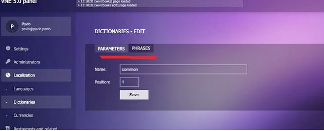
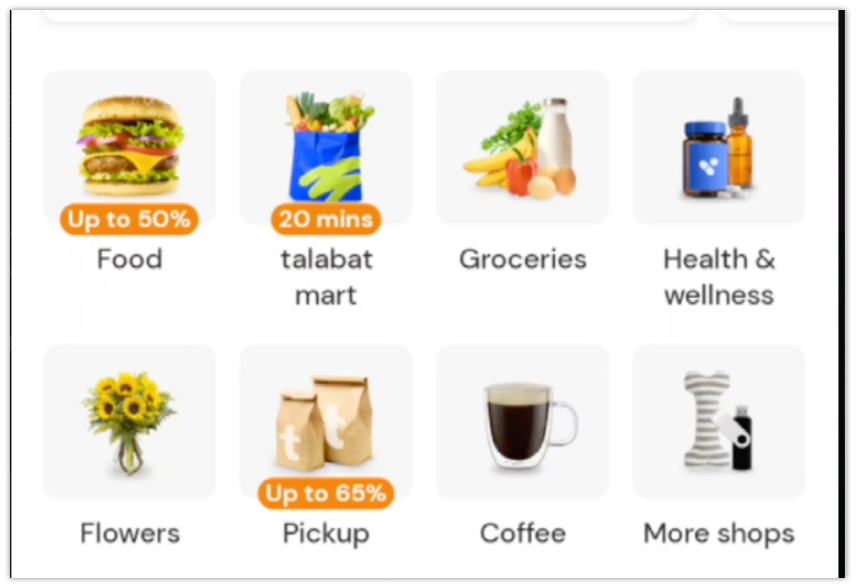

# План Разработки

1. Оплаты - 1,5-2 дня с учетом того что блокер решили
Закончить оплаты на стороне клиента
- форма оплаты
- перевод оплаты на баланс овнера ресторана
- возможно нужно будет собирать доп. информацию для страйпа - будет известно после разрешения блокера со стороны страйпа
2. Отправлять клиенту на почту квитанцию про оплату
  Нужно к оплате добавить поле “Email” - необязательное. Если клиент его заполнил - после оплаты отправлять квитанцию ему на почту
  Добавление альтернативного мерчанта
3. На случай, если на страйпе что-то не будет работать, должна быть возможность быстро переключиться на другую платёжку, например network.ae. Это даст возможность ресторанам продолжать работу используя наше приложение если одна из платёжек перестала работать
4. уведомление официанту после оплаты заказа - после подключения эквайринга
  Отправлять уведомление официанту и менять статус заказа в общем списке заказов на “оплачен”
  2-3 дня
5. Добавить типы подписок
  Пока что будет 2 типа подписок
- Standard (список доступного функционала)
- Pro (будет доступен весь функционал)
6. Перенос на новый сервер, когда оплаты и разделение будут готовы - 1 день
7. Возможность менять ставку для ресторанов дихрам/день
  Сейчас у нас есть какая-то фиксированная ставка, сколько ресторан платит в день за пользование нашим сервисом
  Нужно, чтобы при добавлении новых ресторанов была одна и та же ставка, но чтобы ее можно было менять в любой момент и соответственно ежедневно снимать средства по новой ставке

8. ~~ ~~Разделение отелей и ресторанов - 2 часа 
Делаем вкладки кнопками, 3 параметра - “All”, “Restaurants”, “Hotels”
~~ ~~
9. ~~ ~~Проблема с сокетами - Приблизительно 3 дня
Быстрого решения нет, оно действительно может отваливаться из-за проблем с интернетом. Можно попытаться маскировать это таким образом, что первые N переподключений не будут отображаться в ошибках, поднять таймауты. Сложность в том, что подобных ошибок еще не встречалось на локальном сервере.
UPD: доделать event sourcing, чтобы при реконнектах доотправлялись пропущенные реквесты. Потому что сейчас могут быть баги, когда рестораторам/кастомерам что-то не долетает при проблемах со связью.~~ ~~

10 и 11 пункт сделаю вместе, 5 дней
10. ~~ ~~Группировка заказов за 1 столом в режиме реального времени
В админ панели для официантов заказы будут групироваться в режиме реального времени для каждого стола. Например, за столом №1 сделали 3 заказа с разных устройств. У официанта эти заказы будут сгруппированы визуально (скорее всего добавлю какую-то рамку) и будет одна кнопка “Объединить счет” (функционал см. в п.6).~~ ~~

11. ~~ ~~Объединение счета
При клике на “Объединить счет” у всех клиентов за одним столом в текущее воремя обновится счет и будет выводиться общая сумма за весь заказ. После оплаты заказа одним из клиентов, у всех заказов с этого стола появится статус “оплачено” или “completed”, и у других клиентов счета также анулируются.~~ ~~

12. ~~ ~~Логирование (показывать в отдельном разделе информацию про время входа, IP и устройство, когда админ или ресторатор заходит в соотвестенную панель ) - 1-2 дня, возможно нужно будет сделать правки по авторизации~~ ~~

# На будущее

1. Настроить панель разработчика google play console
2. настройка допродаж (например гость заказывает блюдо из категории “бургер” и картошку - предлагать напиток по скидке) - возможность рестораном настраивать такие допродажи
3. добавить информацию про аллергены (добавить в админку список аллергенов, на странице блюда добавлять аллергены из выпадающего списка, на клиентской части - страница details - выводить список аллергенов )
4. Функционал акционной цены 
Добавить переключалку “цена по акции” вкл/выкл. Если вкл - вводим акционную цену и на клиентской части добавить плашку со значком скидки и цены без акции (перечеркнуто) и текущую цену с акцией
5. система со статусом заказа пример

6. добавление складов 
возможность сортировать продукты по складам, показывать информацию по складам (отдельно проинвестигейтить)
7. контроль качества продуктов 
- задавать срок годности продукции, с алертом если срок подходит к концу 
8. для кухни 
система с рецептом блюда и фото подачи
(добавить новую роль - работник кухни)
9. Конструктор QR кодов - 2 дня
10. Общая кастомизация для всех QR кодов - со значком NFC, пока не сделали конструктор - нужно оценить, вопрос в том, чтобы иконка корректно отображалась на QR коде и не перекрывала ссылку  
11. Система для просчета себестоимости блюда (карта блюд) - отдельная система или API для интеграции на кухню
Большая задача, 4-5 дней, полная оценка будет после полного инвестигейта, пока что приблизительный план:
Нужно для ресторанов добавить карту ингредиентов, где можно будет отслеживать расходы по каждому блюду. Для ингредиента пишется цена за определенную граммовку или количество (например цена за 10 яиц, или за 1000г соли) – единицу измерения можно выбирать через дропдаун
Заложить конвертацию единиц измерения (например 1000г = 1 кг) – нужно для удобства, потому что рестораны закупают большое количество продуктов
шт (штуки)
кг (килограммы)
г (граммы)
мг (миллиграммы)
л (литры)
мл (милилитры)
Далее в блюде прописывается, какие ингредиенты и в каком количестве входят в блюдо (единица измерения либо будет подбираться либо в зависимости от единицы измерения, которая в этом ингредиенте прописана глобально, либо можно будет вручную через дропдаун выбирать)
Соответственно будет считаться себестоимость этого блюда

12. Приложение для клиентов
- Личный кабинет
- Баланс
- На подумать
  - вывод транзакций
  - пополнение баланса
  - оплата заказов с баланса
- Системы бонусов, которые регулируются ресторанами
  - система лояльности для клиентов 
  - акции, купоны, реферальные программы
  - удержание гостей: бонусы, обратная связь, подписки
  - возврат гостей: сгорающие бонусы, подарки, персональные предложения
  - Можно определять, если клиент давно не пользовался приложением, отправлять спец предложения, скидки и тд   
  - кешбеки
  - партнерские программы
- Бронирование столиков в ресторанах
- Идеи для поиска ресторана
  - по локации
  - по тегам
  - по кухне (Французкая, Японская и тд)
  - по названию ресторана
  - “Что бы вы хотели съесть” и варианты з общими блюдами (например бургер, суши, пицца, десерты и тд)
- Заказ через QR код (внутренний сканнер для QR)
- Доставка

13. Пересмотреть по системе iiko всё что есть в открытом доступе, подумать как можно улучшить и упростить использование сайта и приложения клиентам, официантам, овнерам и тд? какой функционал из неозвученных можно добавить и как ?
14. Система чаевых - Можно будет оценить после подключения оплаты через криптовалюту
 (Клиент при оплате счета будет нажимать на кнопку “добавить чаевые”, вводить сумму чаевых в валюте оплаты заказа, после оплаты будет происходить оплата вместе з чаевыми.Как вариант - для официантов сделать баланс с возможностью вывода средств на свой криптокошелёк, который будет указываться в настройках официанта)

15. Отправка заказов на кухню - пример система “iiko”
Когда клиент делает заказ, нужно его сразу отправлять на кухню с информацией про ингридиенты и себестоимость (см. п.5)

16. интеграция с голосовыми помощниками. Активация команд по голосу (например, “позови официанта”)

17. Возможность написать собственный банк с решением, которое нам необходимо для платёжек

Больше ориентирован на бизнес клиентов, но также доступен для частных клиентов добавить инвестиционные программы

создать собственный банк (сначала примитивный, со всем необходимым функционалом, позже - с более расширенным и максимально удобным функцыионалом) 
- собственный эквайринг
- нужно будет найти и продумать все возможные виды переводов средств для разнообразных сервисов (кому удобно со счета на счет пересылать средства, кому - через общий счет, и тд)
- продумать размер комиссий после интеграций со сторонними платежками visa/mastercard, чтобы была возможность выйти конкурентом на рынок продумать планы эквайринга в зависимости от расширенности функционала (например, за стандартный функционал будут брать 1,5% комиссии, за шире 3%, за полный - 5%)
Второй и дальнейшие этапы
- KYC сертификация
- добавить основные функции работы с криптовалютой (торговля криптой в пару кликов, фьючерсы и тд)

18. Криптоплатформа
- должны быть фьючерсы
- возможность торговли крипты - чтобы можно было продавать, покупать
- личный кошелёк
- тестирование системы

19. Фильтрация объектов по категориям (по примеру приложения)
  На это можно уже заложить функционал - 1-2 дня
  Но также нужно больше деталей, где нужно делать выбор и создание категорий

20. Статистика по загруженности ресторанов
В приложении нужно будет показывать загруженность ресторанов, при бронировании например
21. Система для отслеживания статуса заказов на экране
Например, клиент заходит в ресторан, делает заказ через QR код (без официанта). Его заказ отправляется в список заказов ресторана, а также - в отдельную систему, которая на экранах выводит статус по заказу и номер заказа

# Не забыть

1. Есть идея в будущем в приложение интегрировать разнообразные сервисы, по типу аренды машин, такси, доставки, магазинов и тд
2. Добавить функционал для знакомств
Например, в телеграмме есть функция "люди рядом", можно будет что-то подобное добавить. Чтобы пользователь в профиле включал обнаружение геолокации и статус по типу "разрешить знакомства" и видел людей с таким же статусом Добавить нетворкинг по интересам
3. Интеграция с нейросетью (например, может подсказать куда сходить поесть в зависимости от текущей локации)
4. прогноз продаж для менеджеров ресторана 
Можно подключить какой-то ИИ, который будет анализировать закупки в зависимости от сезона, дня и сделать алерт когда необходимо закупить те или иные продукты 

